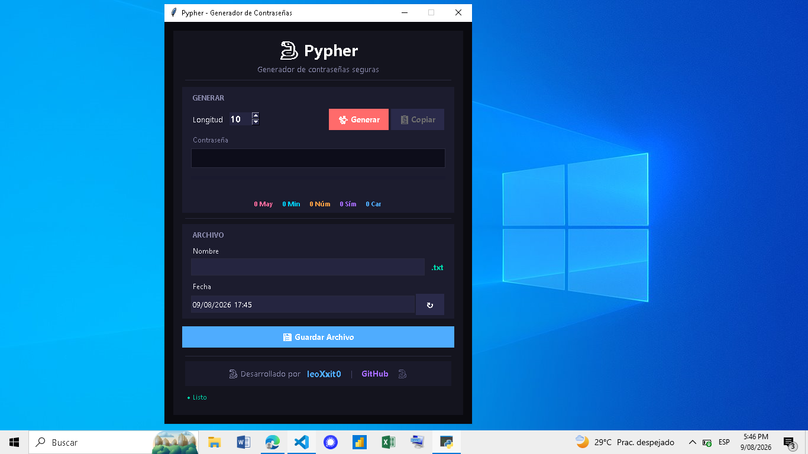
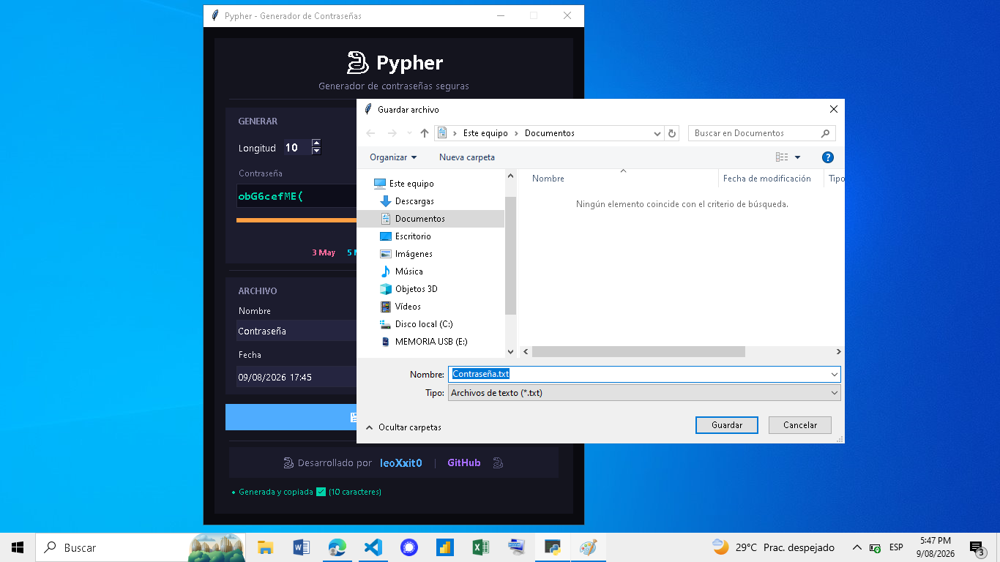
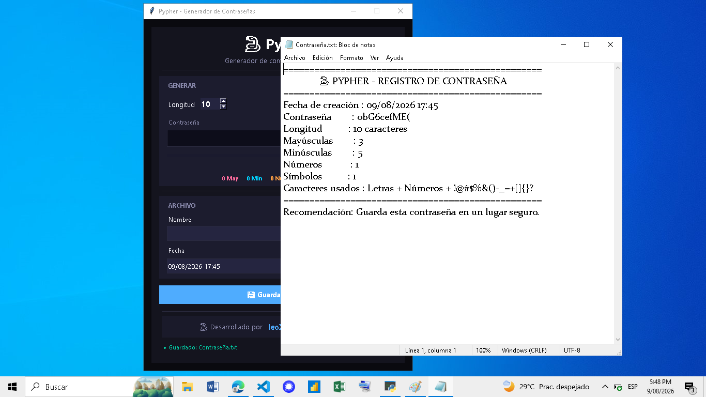

# 🐍 Pypher - Generador de Contraseñas Seguras


---

## 📌 Descripción

**Pypher** es un generador de contraseñas seguras con interfaz gráfica moderna y oscura. Diseñado para crear contraseñas robustas de **8 a 20 caracteres** utilizando **caracteres especiales seguros**, compatibles con la mayoría de sistemas (bancos, correos electrónicos, redes sociales, servidores, etc.).

El proyecto fue desarrollado con **Python y Tkinter**, integrando buenas prácticas de seguridad informática y una experiencia de usuario fluida. Incluye **copia automática al portapapeles**, análisis de fortaleza en tiempo real y guardado de contraseñas en archivos `.txt` con formato estructurado.

---
## 🚀 Instalación y Ejecución

Sigue estos pasos para ejecutar Pypher en tu computadora:

### 1. Clonar el repositorio

```bash
git clone https://github.com/leoXxit0/pypher-password.git
cd pypher-password
```
### 2. Crear y activar un entorno virtual (recomendado)
```bash
python3 -m venv venv
source venv/bin/activate
```
### 3. Ejecutar la aplicación
```bash
python pypher.py
```

### Filtro de Símbolos: Seguridad y Compatibilidad
Pypher elige cuidadosamente los caracteres especiales para que tu contraseña sea fuerte y funcione en cualquier sistema (bancos, redes sociales, servidores, etc.).

### Caracteres Seguros (Los que usamos)
Usamos un conjunto de símbolos universalmente aceptados:
! @ # $ % & ( ) - _ = + [ ] { } ?

### ¿Por qué? 
Son compatibles con el 99% de los sistemas, desde bases de datos hasta comandos en terminal.

---

## 🎨 Capturas de Pantalla

### Interfaz Principal


### Generando una Contraseña


### Guardando Archivo


### Ejemplo de Archivo Generado


---

## ⭐ Apoya el Proyecto

Si este proyecto te ha sido útil, considera:

- Darle una ⭐ en GitHub
- Compartirlo con otros desarrolladores
- Reportar issues o sugerir mejoras
