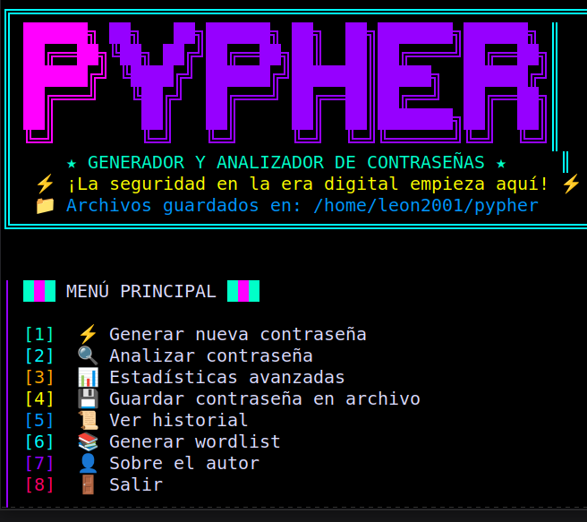
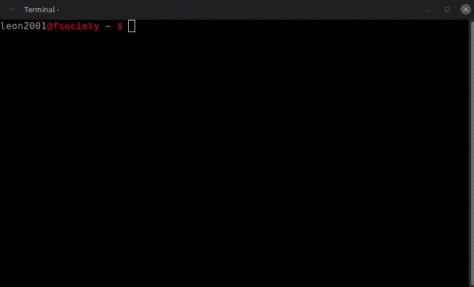
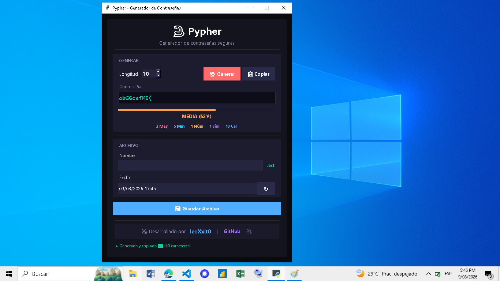

# 🐍 Pypher

> **Generador y Analizador de Contraseñas CLI** — Suite de seguridad profesional para terminal

Pypher es una herramienta de línea de comandos diseñada para cubrir todo el ciclo de vida de la gestión de contraseñas: generación segura, análisis de fortaleza, estadísticas avanzadas, wordlists personalizadas y almacenamiento local.


---

## 🚀 Características

| Módulo | Descripción |
|--------|-------------|
| **⚡ Generador** | Crea contraseñas de 8 a 20 caracteres con 77 caracteres posibles (mayúsculas, minúsculas, números y símbolos) |
| **🔍 Analizador** | Evalúa la fortaleza con 8 criterios rigurosos (0–8 puntos) y niveles FUERTE / MEDIA / DÉBIL |
| **📊 Estadísticas Avanzadas** | Entropía en bits, tiempos de crackeo estimados (MD5/SHA256/bcrypt en GPU/CPU), detección de patrones y verificación en leaks |
| **📚 Wordlists** | Genera diccionarios personalizados con límite de seguridad de **50,000 variantes**, incluye fuerza bruta, mutaciones y combinaciones |
| **💾 Persistencia** | Guarda contraseñas y análisis en `~/pypher/` con soporte para subcarpetas y compresión `.gz` |
| **📋 Portapapeles** | Copia automática al portapapeles (soporte `pyperclip`, `xclip` y `wl-clipboard`) |

---
### 🔒 Filtro de Símbolos: Seguridad y Compatibilidad

Pypher elige cuidadosamente los caracteres especiales para que tu contraseña sea fuerte y funcione en cualquier sistema (bancos, redes sociales, servidores, etc.).

**Caracteres seguros (los que usamos):**

```
! @ # $ % & ( ) - _ = + [ ] { } ?
```

**¿Por qué?** Son compatibles con el 99% de los sistemas, desde bases de datos hasta comandos en terminal.

# Sobre el Generador de WordList
El programa tiene un diccionario interno con más de 100 palabras comunes que la gente suele usar en contraseñas (admin, password, qwerty, love, dragon, etc.). Esto hace que las wordlists sean mucho más realistas y útiles.

---
## 🚀 Instalación y Ejecución (Versión CLI)

Sigue estos pasos para ejecutar Pypher en tu teminal:



### 1. Clonar el repositorio

```bash
git clone https://github.com/leoXxit0/pypher-password.git
cd pypher-password
```
### 2. Instalar pyperclip (portapapeles OPCIONAL)
```bash
pip3 install pyperclip
```
### 3. Ejecutar
```bash
python3 pypher_linux.py
```
### Tutorial 


---

## 🚀 Instalación y Ejecución (Versión GUI - NO ACTUALIZADO)

### 1. Instalar Tkinter (interfaz gráfica)

```bash
sudo apt install python3-tk -y
```
### 2. Instalar pyperclip (portapapeles OPCIONAL)
```bash
pip3 install pyperclip
```
### 3. Clonar el repositorio

```bash
git clone https://github.com/leoXxit0/pypher-password.git
cd pypher-password
```
### 4. Ejecutar
```bash
python3 pypher.py
```


Esto abrirá el **Menú Principal**, desde donde puedes acceder al Generador, al Analizador, o ver el placeholder del futuro Generador de Wordlist.

> 💡 Pypher no requiere librerías externas: solo usa la librería estándar de Python (`tkinter`, `random`, `string`, `re`, `datetime`, `os`, `webbrowser`).

---

## ⭐ Apoya el Proyecto

Si este proyecto te ha sido útil, considera:

- Darle una ⭐ en GitHub
- Compartirlo con otros desarrolladores
- Reportar issues o sugerir mejoras
